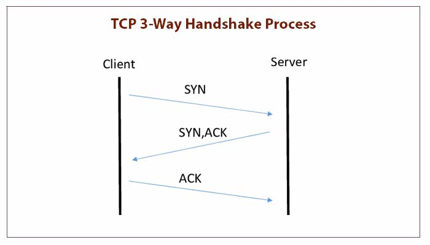
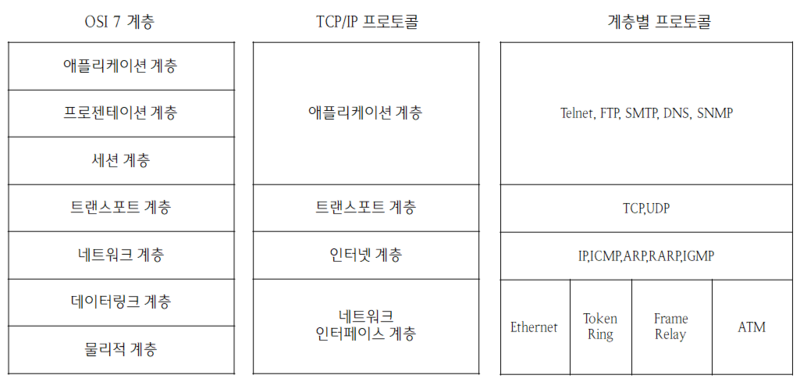

# HTTP의 이해

HTTP를 알기 전에, 과거부터 어떻게 통신을 맺고 데이터를 주고 받았는지 알아보자.

## TCP와 UDP

전송 계층의 대표적인 프로토콜

* TCP: 연결이 필요함. 전달 및 순서 보장. (전화)
* UDP: 연결하지 않고 데이터를 보냄. 전달 및 순서를 보장하지 않음. (편지)

## TCP/IP

TCP/IP는 하나의 프로토콜이 아닌 TCP와 IP를 합쳐 부르는 말이다.

> TCP/IP를 사용하겠단 것은 IP 주소 체계를 따르고 IP Routing을 이용해 목적이에 도달하며, TCP의 특성을 활용해 송신자와 수신자의 논리적 연결을 생성하고 신뢰성을 유지할 수 있도록 하겠다는 것을 의미한다.

IP 프로토콜만 사용했을 경우엔,

* 상대와 연결이 되어있는 것과 상관없이 그냥 보낸다.
* 중간 서버(노드)가 다운돼서 패킷이 사라질 수 있다.
* 순서를 보장하지 않는다. (패킷이 전송되는 루트가 제각각이기때문이다.)
* 또 같은 IP를 쓰지만, 게임과 동시에 음악도 들을 때는 동시에 처리가 불가하다.

따라서 TCP 세그먼트에 추가 정보들(출발지 port, 도착지 port, 전송제어, 순서, 검증 등)을 추가해서 같이 보내는 것이다.


**Port** : 같은 IP 내에서 프로세스 구분할 때 쓰인다.



IP는 변경될 수 있다. 따라서 DNS(Domain Name System)을 이용한다.&#x20;

일종의 **전화번호부**처럼 도메인 명을 IP주소로 변환해준다.


## TCP 특징

IP 프로토콜만 이용했을 때의문제점을 해결할 수 있다.

* **연결 지향 - 3 way handshake**\
  연결이 되면 데이터를 보낸다는 뜻이다.\
  \
  SYN : 접속 요청\
  ACK : 요청 수락
* **packet이 누락되어도 알 수 있다.**\
  1\. 데이터  전송\
  2\. 데이터 잘 받았음(응답) 의 과정을 거치기 때문에 응답이 없으면 누락되었다는 걸로 이해가능
* **순서 보장**\
  순서 안 맞으면 잘못된 부분부터 다시 보내라고 응답한다.

## Socket

* [Berkeley\_sockets](https://en.wikipedia.org/wiki/Berkeley\_sockets)
* [네트워크\_소켓](https://ko.wikipedia.org/wiki/%EB%84%A4%ED%8A%B8%EC%9B%8C%ED%81%AC\_%EC%86%8C%EC%BC%93)

Socket과 Socket API를 구분해야 헷갈리지 않는다.

> Socket : 통신의 end point\
> 클라이언트 socket - 서버 socket이 연결되는 것.\
> 둘이 연결돼서 어떻게 통신할거냐를 프로그래밍 하는게 Socket API를 쓰는 것

Socket은 기본적으로 파일과 유사하게 다룰 수 있다(유닉스에서는 파일 디스크립터의 일종).

Java에서는 키보드 입력, 화면 출력, 파일 입출력 등과 마찬가지로 **Stream**으로 다룰 수 있다.\
(Java 8에서 도입된 Stream API가 아님에 주의!)

## TCP 통신 순서

1. 서버는 접속 요청을 받기 위한 소켓을 연다. → Listen
2. 클라이언트는 소켓을 만들고, 서버에 접속을 요청한다. → Connect
3. 서버는 접속요청한 클라이언트와의 통신을 위한 소켓을 따로 만든다. → Accept
4. 소켓을 통해 서로 데이터를 주고 받는다. → Send & Receive ⇒ 반복!
5. 통신을 마치면 소켓을 닫는다. → Close ⇒ 상대방은 Receive로 인지할 수 있다.

> 2번, 3번에서, TCP의 3 way handshake가 수행되는것이다. &#x20;

## HTTP란?

HTTP는 HTML 문서와 같은 리소스(이미지, 영상, 파일)들을 가져올 수 있도록 해주는 프로토콜이다.


#### 프로토콜 : 규칙의 집합, 규약, 약속


<figure><figcaption>
OSI 7 계층 &#x26; TCP/IP 프로토콜
</figcaption></figure>

OSI 7 계층 중  2, 3, 4, 7계층만 살펴보자.\
(인터넷 표준이 TCP/IP 4계층 프로토콜이다.)

1. 2계층 - 데이터 링크 계층 ⇒ MAC address (물리적 고유 주소)&#x20;
2. 3계층 - 네트워크 계층 ⇒ IP address
3. 4계층 - 전송 계층 → TCP, UDP ⇒ Port number (프로그램 별 부여)
4. 7계층 - 응용 계층 → HTTP 등
   1. HTTPS를 위한 TLS 같은 보안 계층이 먼저 들어갈 수도 있다.\
      (=TLS을 한 번 거쳐간다.)

<figure><figcaption>
인터넷TCP/IP 프로토콜 4계층
</figcaption></figure>

## **클라이언트-서버 구조**

1. 서비스/리소스 -> 리소스를 특정하기 위해 URL을 사용한다.
2. 클라이언트 -> 요청
3. 서버 -> (처리 후)응답


URL 문법

scheme://\[userinfo@]host\[:port]\[/path]\[?query]\[#fragment]

* **sheme**\
  주로 프로토콜 사용 ex) http, https
* **userinfo**\
  ****URL에 사용자 정보 포함해서 인증\
  거의 사용하지 않음
* **host**\
  호스트명\
  도메인명 또는 IP 주소를 직접 사용가능
* **port**\
  접속 포트\
  일반적으로 생략, http는 80, https는 443 사용
* **path**\
  리소스 경로, 계층적 구조\
  ex) /members\
  /members/100
* **query**\
  key=value 형태\
  ?로 시작, &로 추가 가능\
  query string으로도 불림
* **fragment**\
  http 내부 북마크 등에 사용\
  서버에 전송하는 정보 아님


## Stateless Protocol

1. HTTP는 각각의 요청이 독립적이다.
2. 즉, 클라이언트는 항상 자신이 누군지 알려줘야한다.\
   따라서 아래 방법들로 보완한다.
   * 요청과 응답을 통해 계속 주고 받는 쿠키
   * 데이터는 서버에서 관리하고 쿠키 등으로 key를 관리하는 세션
   * 웹 브라우저의 기능(local storage 등)


Stateless란 특징이 갖는 장점은, \
갑자기 Client 요청이증가해도 서버를 대거 투입할 수 있다.\
또한, 응답서버를 쉽게 바꿀 수 있다.\
따라서 무한한 서버 증설이 가능케 한다.


## 비연결성

**HTTP는 비연결성이다.**

요청-응답을 주고 받을 때만 연결하고 끊어버린다.

**장점** : 동시에 유지하는 자원을 아낄 수 있다.

**단점** :&#x20;

* TCP/IP 연결을 다시 새로 맺어야함 (3 way handshake)
* 한 화면을 구성하는 데이터는 HTML말고도 css, js 그리고 이미지까지 있다.
* 따라서, 페이지를 불러올 때마다 연결을 다시 맺고 데이터들을 불러오면 비효율적이다.

**해결책** : 이미지와 같은 큰 데이터들은 지속 연결로 해결한다고 한다. \
ex) 몇 초 동안 유지

## HTTP 메시지

1. 기본적으로는 사람이 읽을 수 있는 형태
2. 요청과 응답 모두 동일 구조
   1. Start line → 요청과 응답의 형태가 다름.
   2. Headers -> HTTP 전송에 필요한 모든 부가정보 ex) Content-Length
   3. 빈 줄
   4. Body : 실제 전송할 데이터 (Byte로 표현 가능한 모든 데이터 전송 가능)
      1. 크기를 알기 어렵다. Headers의 Content-Length 항목 등을 활용한다.
      2. 위와 다르게 꼭 사람이 읽을 수 있는 텍스트 형태일 필요는 없다. 바이너리 등 가능.
      3. 하나가 아니라 여럿일 수도 있다. 파일 업로드 등을 위해 쓰이는 multipart/form-data가 대표적.

## [HTTP Method](https://developer.mozilla.org/ko/docs/Web/HTTP/Methods) (요청)

1. GET → Read
2. HEAD → GET without body
3. POST → Submit (멱등성X) ⇒ Collection Pattern에서 Create로 사용
4. PUT → Update (+Create) ⇒ Overwrite!
5. PATCH → Update (partial) (멱등성X)
6. DELETE → Delete
7. OPTIONS → 지원 확인


**멱등성 :** 한 번 호출하던 두 번 호출하던 100번 호출하던 결과가 똑같다

**GET, PUT, DELETE : 멱등**

**POST : 멱등 X  ex) 회원가입 요청 여러번하면 회원 여러명된다**&#x20;


## [HTTP Status Code](https://developer.mozilla.org/ko/docs/Web/HTTP/Status) (응답)

1. 1xx → 정보 ⇒ 우리가 직접 쓰는 일은 드믐.
2. 2xx → 성공 ⇒ 200 OK, 201 Created, 204 No Content
3. 3xx → 리다이렉션 ⇒ 304 Not Modified가 특수한 형태로 자주 보임.
4. 4xx → 클라이언트 쪽 문제 ⇒ 404 Not Found
5. 5xx → 서버 쪽 문제 ⇒ 500 Internal Server Error
