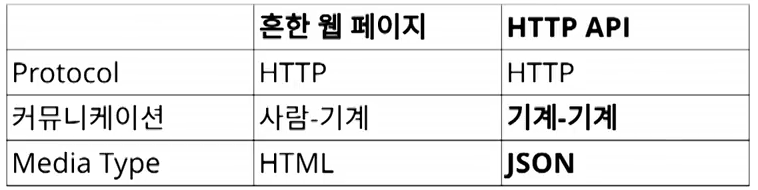
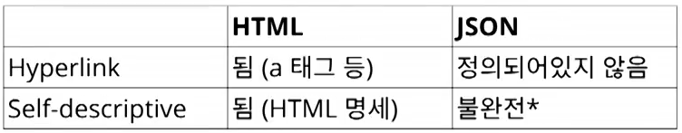

# REST API

## REST API

REST 아키텍처의 제약 조건을 준수하는 웹 API를 RESTful API라고 합니다.

6가지 주요 제약 조건을 준수했을 때 RESTful API라고 간주할 수 있습니다.

REST는 Network-based Software Architecture를 위한 Architecture Style(=제약 조건의 집합)이다.\
Hybrid Architecture Style으로도 불린다. 왜냐면 REST의 제약조건이 각각 Architecture Style이기 때문

1. **Client-Server**

클라이언트-서버 아키텍처 스타일\
사용자 인터페이스 문제와 데이터 스토리지 문제를 분리하여 여러 플랫폼에서 사용자 인터페이스의 이식성을 향상시키고 서버 구성 요소를 단순화하여 확장성을 향상시킨다

2. **Stateless**&#x20;

클라이언트-스테이트리스-서버 스타일\
무상태여야한다 -> 클라이언트는 요청할 때마다, 요청을 이해하는데 필요한 모든 정보를 포함해야한다.

3. **Cache**&#x20;

클라이언트-캐시-스테이트리스-서버 스타일을 향상시키기 위해 캐시 제약조건 추가\
캐시 제약 조건은 요청에 대한 응답 데이터(ex.이미지, 동영상 등)가암묵적 또는 명시적으로 캐시 가능 또는 캐시 불가능으로 지정되어야 한다\
응답이 캐시 가능한 경우 클라이언트 캐시는 나중에 동등한 요청을 위해 응답 데이터를 재사용할 수 있는 권한을 부여받는다

4. **Layered System**

계층화된 시스템 스타일\
계층화된 시스템 스타일은 각 구성요소가 상호작용하는 직접적인 계층을 넘어서서 "보는" 것이 불가능하도록 구성요소 행동을 제한함으로써 계층화 계층으로 구성될 수 있게 한다.

5. **Code-On-Demand** (Optional)

스크립트 형태의 코드(ex. javascript)를 다운로드하고 실행하여 클라이언트 기능을 확장할 수 있다.\
이는 사전 구현에 필요한 기능의 수를 줄임으로써 클라이언트를 단순화하지만 가시성도 감소하므로 선택적 제약조건이다.

6. <mark style="color:red;">**Uniform Interface**</mark>** (인터페이스 일관성)**

자원에 대한 요청을 통일하고 한정적인 인터페이스로 수행하는 **아키텍처 스타일**

Uniform Interface를 따르기 위해선 제약조건이 필요하다.

a. **identification of resources**

URI라는 고유 식별자를 사용하여 자원을 식별한다

b. **manipulation of resources through representations**

* 클라이언트가 자원을 요청할 때 서버는 **자원 자체(resource)가 아닌 자원의 표현(representation)으로 응답**한다.
* 자원의 표현(representation)은 현재 자원의 상태를 반영하는 정보이며, 이는 클라이언트가 이해하고 조작할 수 있는 형식이다.
  * 대표적인 예로 HTML, JSON, XML 등이 있다.
* 클라이언트가 특정 표현 형식을 요청하고 서버가 요청에 맞는 표현을 제공하는 것을 컨텐츠 협상(content negotiation)이라고 한다.
  *   plain text로 요청

      ```jsx
      GET /orders/12345
      Accept: text/plain
      ```
  *   JSON으로 요청

      ```jsx
      GET /orders/12345
      Accept: application/json
      ```

#### c. **self-descriptive messages**

말 그대로 **메시지 스스로가 자신에 대해 설명할 수 있어야 한다**는 것.

1. Self-descriptive 하지 않은 경우 (요청메시지)

```
GET / HTTP/1.1
```

why? -> 목적지를 알 수 없다. -> Host란 헤더를 추가해줘야한다.

```http
GET / HTTP/1.1
Host: www.example.org
```

2. Self-descriptive 하지 않은 경우(응답 메시지)

```http
HTTP/1.1 200 OK

[ {"op" : "remove", "path" : "/a/b/c"} ] 
```

why? -> body 내용이 어떤 문법인지 모른다 -> Content-Type 추가해야한다.

```http
HTTP/1.1 200 OK
Content-Type: application/json

[ {"op" : "remove", "path" : "/a/b/c"} ] 
```

하지만, 이렇게 해도 Self-descriptive하지않다.

why? -> "op", "path"가 뭘 의미하는지 모른다.

```http
HTTP/1.1 200 OK
Content-Type: application/json-patch+json

[ {"op" : "remove", "path" : "/a/b/c"} ] 
```

application/json-patch+json에 해당하는미디어타입 명세를 찾아가서 이해한 다음에 메시지를 해석하면 된다. -> 이제야 Self-descriptive라고 말할 수 있다.

d. **hypermedia as the engine of application state (HATEOAS)**

* Hypermedia(링크)에 자기 **자신에 대한 정보**가 담겨야 한다.
* Hypermedia(링크)를 통해서 **애플리케이션의 상태 전이**가 가능해야 한다.
  *   **상태 전이**란 해당 URI에서 사용자가 다음 행동으로 취할 수 있는 것들을 말한다.

      ```jsx
      예: 게시글을 조회 했다면 여기서의 상태 저이는 다음과 같다.
      	- 다음 게시물 조회
      	- 게시물 내 피드에 저장
      	- 댓글 달기
      ```
  * 이러한 상태 전이가 가능한 것들을 응답 본문에 넣어줘야 한다.
  * 이러한 모든 동작을 URI를 통해 도적으로 알려준다는 의미이다.

## 오늘날의 REST API

REST Architecture Style을 따르지 않는다.

Self-descriptive, HATEOAS를 지키지않아도 그냥 REST라고 부른다.

왜 API는 REST가 잘 안 되나?  (그냥 웹 페이지는 REST가 잘 되는데..)

<figure><figcaption></figcaption></figure>

프로토콜은 HTTP로 동일하지만 HTTP API는 기계가 알아들을 수 있게 JSON 미디어 타입을 사용한다.\


여기에서 문제가 발생합니다

<figure><figcaption></figcaption></figure>

JSON은 하이버링크가 정의되어 있지 않고, Self-descriptive의 경우 HTML은 HTML 명세에 HTML에 사용할 수 있는 모든 태그들이 정의되어 있지만 JSON은 오브젝트안에 키와 밸류가 어떤 의미를 가져야 하는지 정의되어 있지 않다.

[불완전 하다는 의미는 문법적인 부분만 정의되어 있기 때문입니다.](rest-api.md#c.-self-descriptive-messages)

문법은 해석이 가능하지만, 의미를 해석하려면 별도로 문서가(API 문서 등) 필요합니다

## **Resources** 와 Representations

**HTTP에서의 representation**

GET 메서드의 정의는 다음과 같다.\
**target resource에 대한 현재의 선택된 representation 하나를 반환한다**

****

GET 요청을 서버에 보낸 상황을 보자

```
GET https://example.org/greeting
Host: example.org
Accept: text/plain, text/html; q=0.9 *; q=0.1
Accept-Language: en, ko; q=0.9, *; q=0.1

```

“hello”라는 메시지를 응답으로 받았다고 해 보자.

```
HTTP/1.1 200 OK
Content-Length: 6
Date: Sun, 19 Mar 2017 10:20:47 GMT
Last-Modified: Sun, 19 Mar 2017 08:00:00 GMT
Content-Type: text/plain
Content-Language: en

hello
```

* “target resource”란 https://example.org/greeting 라는 uri가 가리키는 리소스이다
* 하나의 representation은 **representation data**와 **representation metadata**로 구성된다.
* 위의 예에서는 “hello”가 representation data이고, “Content-Type: text/plain”과 “Content-Language: en”이 representation metadata이다.
* representation은 사실 상 HTTP 메시지이다.
* 성숙한 REST라면 representation에 하이퍼미디어 컨트롤이 포함되어야한다는 것

****
