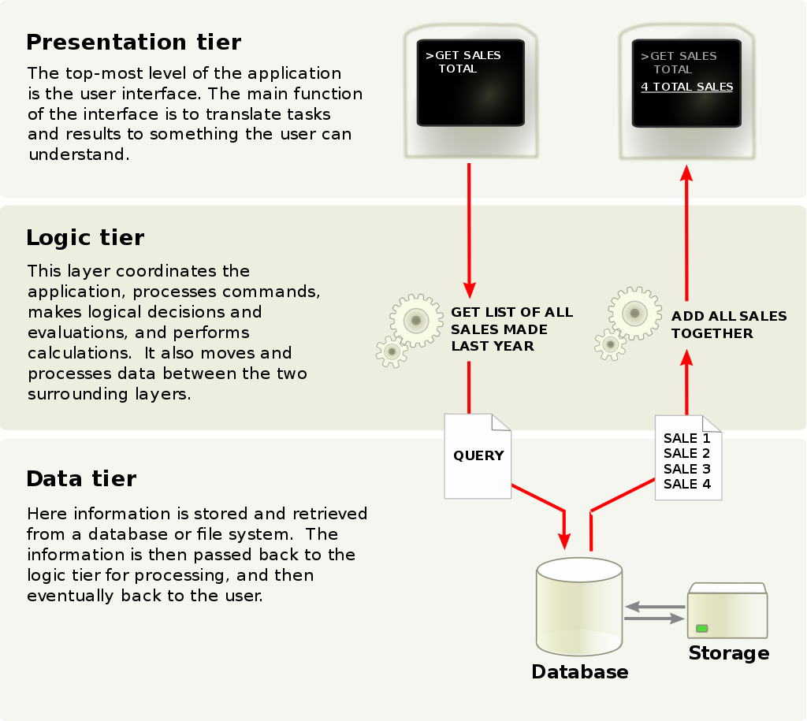
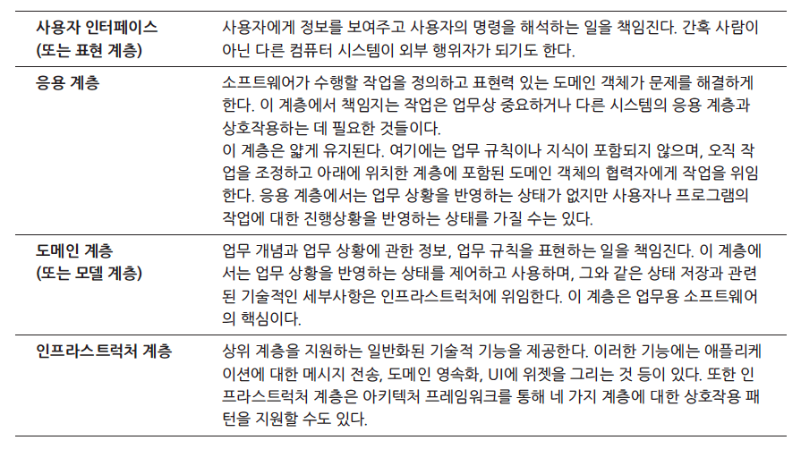

# Layered Architecture

## 관심사의 분리 (Separation of Concerns)

> [관심사의 분리](https://ko.wikipedia.org/wiki/%EA%B4%80%EC%8B%AC%EC%82%AC\_%EB%B6%84%EB%A6%AC)

커다란 프로그램은 유지보수가 어렵다. 인간의 한계 + 공간의 한계

유지보수가 가능하도록 적절하게 나누고, 그룹화해야 한다.&#x20;

가장 가까이 있는 예로, 시스템의 폴더나 Java의 패키지 등이 이를 위해 존재한다.

인간의 한계를 알고 효율적으로 활용하자! -> 관심사를 분리하자

### 모듈화 - 응집도와 결합도

참고 링크 : [https://madplay.github.io/post/coupling-and-cohesion-in-software-engineering](https://madplay.github.io/post/coupling-and-cohesion-in-software-engineering)

#### **모듈화란** 소프트웨어를 각 기능별로 나누는 것을 말한다.&#x20;

그리고 각각의 기능별로 나눠진 모듈화의 결과를 **모듈(Module)**이라고 하며 소프트웨어 내의 프로그램 또는 작업 단위 등의 의미로 사용된다.&#x20;

여기서 **좋은 모듈화는 목적에 맞는 기능만으로 모듈을 나누는 것**이다. \
각각의 모듈은 주어진 기능만을 독립적으로 수행하며 다른 모듈과 **적게 연관**돼야 한다.

즉, **독립성이 높은 모듈일수록 좋다.** 독립성이 높으면 해당 모듈을 수정하더라도 다른 모듈에 끼치는 영향이 적으며 오류가 발생하더라도 쉽게 문제를 발견하고 해결할 수 있는 장점을 갖는다.

한편 **모듈의 독립성은 모듈의 결합도(Coupling)와 응집도(Cohesion)로 측정한다.** 결론적으로는 모듈의 독립성을 높이기 위해서는 모듈 간의 상호 의존 정도를 나타내는 결합도를 낮추고 모듈이 독립적으로 자체 기능만을 수행하도록 응집도를 높여야 한다

#### 결합도**란** 서로 다른 모듈 간에 상호 의존하는 정도 또는 연관된 관계를 의미한다.&#x20;

간단하게 자바(Java)의 클래스로 예를 들면, 결합도가 높은 클래스는 다른 클래스와 **연관된 정도가 높다.**

&#x20;따라서 해당 클래스를 변경하면 연관된 클래스도 변경해야 하며, 다른 코드에서 클래스를 **재사용하기도 어렵다.**

**가장 좋지 않은 결합도를 갖는 형태**는\
어떤 모듈이 사용하려는 **다른 모듈**의 내부 기능과 데이터를 **직접 참조**하는 경우다.

다른 모듈의 로컬 데이터에 접근하는 경우처럼 사용하고자 하는 모듈의 내용(코드)을 알고 있어야 한다.\
모듈이 변경이 발생하는 경우 이를 참조하는 모듈의 변경이 반드시 필요하게 되므로 가장 좋지 않은 결합이다.

#### 응집도란 한 모듈 내부의 처리 요소들이 서로 관련되어 있는 정도를 말한다.&#x20;

즉, 모듈이 독립적인 기능을 수행하는지 또는 하나의 기능을 중심으로 책임이 잘 뭉쳐있는지를 나타내며 모듈이 **높은 응집도를 가질수록 좋다.**

**가장 좋은 응집도를 갖는 형태**는 \
****모듈 내의 모든 요소들이 하나의 기능을 수행하기 위해 구성된 경우를 말한다.

### Layered Architecture

참고 링크 : [https://wikibook.co.kr/article/layered-architecture/](https://wikibook.co.kr/article/layered-architecture/)

자 그렇다면, **무엇을 기준**으로 관심사를 분리하면 좋을까?

소프트웨어 시스템을 분리하는 방법은 다양하지만 경험과 관례에 근거해 산업계에서는 \
LAYERED ARCHITECTURE, 좀 더 구체적으로 몇 개의 일반화된 **계층**이 널리 받아들여지고 있다.

**계층화**의 가치는 각 계층에서 컴퓨터 프로그램의 특정 측면만을 전문적으로 다룬다는 데 있다.&#x20;

이러한 전문화를 토대로 각 측면에서는 더욱 응집력 있는 설계가 가능해지며, 이로써 설계를 훨씬 더 쉽게 이해할 수 있다.&#x20;

따라서복잡한 프로그램을 여러 개의 계층으로 나누면 된다.

Layer 또는 Tier로 계층을 나누는 구조가 있다.

* Layered Architecture : 논리적이고 software 측면
* Multi-tier Architecture : 물리적이고 hardware 측면

다층 구조(Multi-tier Architecture)는 비즈니스 로직을 완전히 분리하여 데이터베이스 시스템과 클라이언트의 사이에 배치한 클라이언트 서버 시스템의 일종이다.

예를 들어 사용자와 데이터베이스간의 데이터 요구 서비스에 미들웨어를 이용하는 것을 들 수 있다.&#x20;

일반적으로는 **3층 구조**가 널리 쓰인다.

#### 3층 구조 (3-Tier)

세 층이란 **사용자 인터페이스**, **비즈니스 로직**, **데이터베이스**를 말하며,&#x20;

이들을 각각 독립된 모듈로 개발하고 유지하는 구조(=관심사의 분리)로, 일반적으로 이들은 각각 다른 플랫폼 상에서 구동된다.

<figure><figcaption><p>3-Tier Architecture</p></figcaption></figure>

#### 4-Layered Architecture

<figure><figcaption><p>4-layered Architecture</p></figcaption></figure>

UI Layer -> Spring Web MVC의 controller로 구현

Application Layer -> Business Logic을 services로 구현. 최근에는 services -> applications로 많이 표현

**계층화의 핵심 원칙**은 한 계층의 모든 요소는 오직 같은 계층에 존재하는 다른 요소나 계층상 “아래”에 위치한 요소에만 의존한다는 것이다. -> 상위 계층과의 결합을 느슨하게 유지하라

응집력 있고 오직 아래에 위치한 계층에만 의존하는 **각 계층에서 설계를 발전**시키면 된다.

****

## Identifier

고유한 id 값을 생성해줄 수 있는 식별자이다.

종류로UUID, ULID, TSID가 있다.

### UUID

64비트 고유 식별자

```java
String id = UUID.randomUUID().toString()
```

하지만, UUID는 **Sortable 하지 않다.**

### ULID

UUID 보완

build.gradle에 의존성 추가.

```
implementation 'com.github.f4b6a3:ulid-creator:5.1.0'
```

ID 생성.

```java
String id = UlidCreator.getUlid().toString();
```

생성한 순서대로 값이 작다. **Sortable 하다**

### TSID

ULID 개선&#x20;

ULID보다 더 짧다. + Time **Sortable 하다**

위에서 사용한 라이브러리와 동일한 개발자가 ULID를 개선.

build.gradle에 의존성 추가.

```
implementation 'com.github.f4b6a3:tsid-creator:5.2.0'
```

ID 생성.

```java
String id = TsidCreator.getTsid().toString();
```

## 정리

이렇듯, **관심사의 분리**에 따라 (**계층화**를 통해) 코드를 분리한다.

코드를 어떻게 배치하느냐가 **설계**를 어떻게 하느냐와 같은 말이다.

설계를 했으면 설계를 개선한다. -> 코드를 **리팩터링** 한다와 같은 말이다.


****


