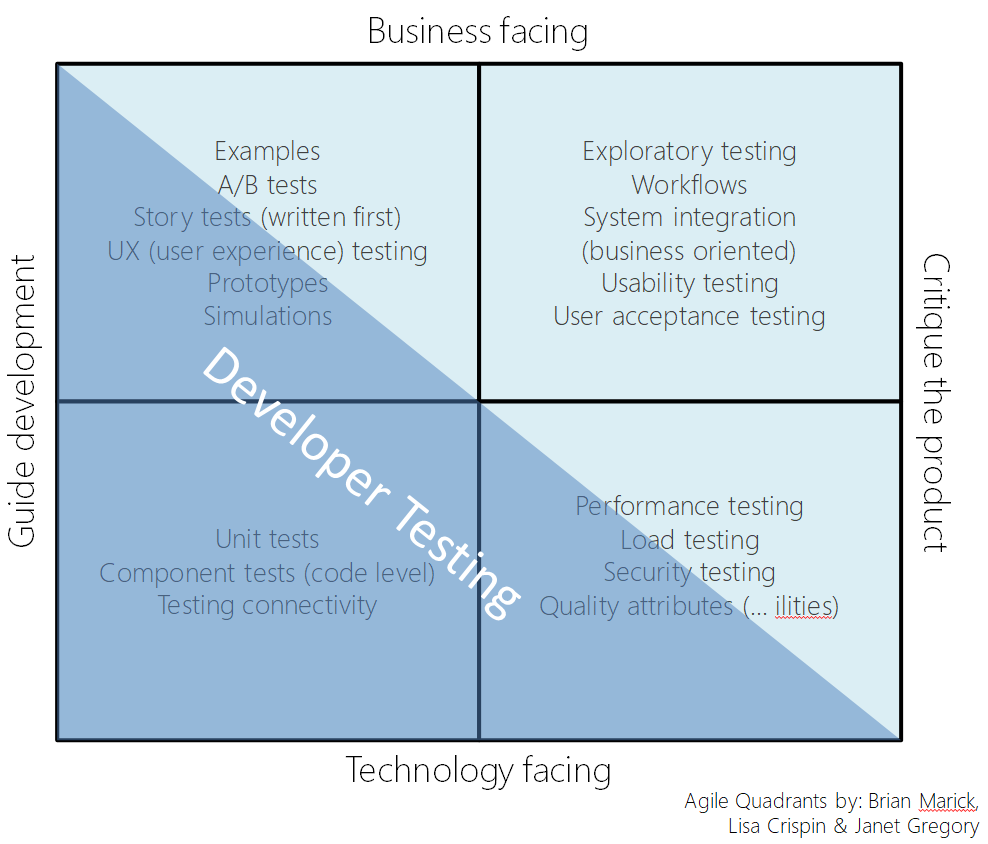

# Unit Test

* V 모델
* Test Matrix
* 내적 품질(테스트 코드 작성등)을 높이면 좋은 이유
* JUnit
* 단위 테스트
* E2E 테스트

## 개발 프로세스

우리가 프로그래밍을 하는 이유: 문제(특히 비즈니스 문제)를 해결하기 위해서.

문제가 잘 해결됐는지 어떻게 확신할 수 있을까?&#x20;

문제를 잘 **정의**하고, 문제가 해결된 모습을 미리 그려보면(**Test**) 절반 정도는 확신할 수 있게 된다.

### [V-Model](https://ko.wikipedia.org/wiki/V\_%EB%AA%A8%EB%8D%B8)

V-Model은 소프트웨어 개발 프로세스 중 하나다.

V 모델은 개발 생명주기의 각 단계와 그에 상응하는 소프트웨어 시험 각 단계의 관계를 보여준다.

<figure><figcaption><p>V-Model</p></figcaption></figure>

V-Model 프로세스를 잠깐 보자면 아래처럼 진행된다고 생각하면 된다.

1. 요구사항 분석 → 사용자 중심 ⇒ 인수 테스트
2. 시스템 설계 → 시스템 사양 결정 ⇒ 시스템 테스트
3. 아키텍처 설계 → 고수준 설계 ⇒ 통합 테스트
4. 모듈 설계 → 저수준 설계 ⇒ 단위 테스트
5. 구현 → 코딩

* Requirements Analysis (요구사항 분석) -> Acceptance Test Design을 하고 -> Test 해보고 그걸 바탕으로 System Design을 한다.
* Acceptance Testing을 모두 통과하면 요구사항(Requirements) 모두 만족한다고 말할 수 있다.
* 그러면 System Design으로 넘어간다. -> 위 과정과 같이, System Test Design -> Test -> Architecture Design

물론, 중간에 문제가 생기면 위로 올라가 다시 내려올 수도 있다.


## 소프트웨어의 품질

### Internal and External Quality

외적 품질

* 우리가 일반적으로 말하는 품질은 외적 품질.
* **사용자**가 경험하고 즐길 수 있는 제품으로서의 모든 속성
* 신뢰성, 정확성, 사용 용이성 및 편안함, 기대치에 대한 적합성 등

내적 품질

* 좋은 제품을 만드는 프로세스에 필요한 소프트웨어의 모든 속성(**개발자** 기준)
* 높은응집도, 낮은결합도, 명확성(문서화) 등

많은 사람들은 최종 결과(기능, 기능 및 정확성)가 동일하다면 소프트웨어의 내부(구현 방법)는 관련이 없다고 주장한다.

이는 맛만 좋으면 되지 주방이 깨끗할 필요가 있냐고 항변하는 식당의 예시와 똑같다.

시간이 지나면 결국 큰일나게 되어있다.&#x20;

* 코드를 변경하려고 할 때, 얼마나 쉽고 유연하게 변경할 수 없게 될 것이다.
* 오류를 처리할 때 안전하게 처리할 수 없게 될 것이다.
* 다른 사람과 협력할 때, 쉽게 상호 운용할 수 없게 될 것이다

**따라서 우린 내적 품질을 향상시켜야한다. -> 어떻게? -> 테스트를 활용해서**

### Test Matrix

가능한 한 결함이 적은(신뢰할 수 있는)테스트는가프트웨어를 만들기 위해 개발자가 테스트 도구 및 기술을 **의도적** 이고 **체계적으로 사용하는 것입니다.**

내적 품질이 높은 소프트웨어를 만들기 위해선 개발자가 테스트 도구 및 기술을 체계적으로 사용해야한다.

가장 기본이 되는 Unit Test부터 잘 알아야한다.

<figure><figcaption><p>Test-Matrix</p></figcaption></figure>

여기서 개발자들이 하는 테스트, Developer Testing은 비즈니스용(Business Facing)이 아니라 기술용(Technology Facing)이며 프로그래밍을 위한 테스트(Guide Development)지, 제품을 비평(Critique the product)하기 위한 테스트가 아니다.

## Unit Test

JUnit을 이용하여 Unit Test를 해보자

### JUnit

[JUnit 5](https://junit.org/)

JUnit은 자동화된 테스트를 지원하는 도구. 이름에 Unit이 들어가지만 단위 테스트만 지원하는 건 아님. 통합 테스트, 심지어는 E2E 테스트를 작성하는데도 사용한다.

### Unit Test 예제 (Newton's Method)

[Example: Square Roots by Newton's Method](https://mitp-content-server.mit.edu/books/content/sectbyfn/books\_pres\_0/6515/sicp.zip/full-text/book/book-Z-H-10.html#%\_sec\_1.1.7)

단위 테스트의 관점에서 질문을 던져보자:

* 믿고 쓸 수 있는 부품인가?
* 믿을 수 있는 부품이 있다면 어떻게 하면 되는가? -> 조합

1. 맨 처음에는 부품이 있다고 가정하고 코드를 작성한다. (Top-Down 형식)
2. 이후에 부품을 확실히 신뢰할 수 있도록 구현하면, 해당 조합은 저절로 신뢰할 수 있게 된다.\
   (올바른 goodEnough와 improve만 주어진다면, 전체 코드는 대부분의 경우엔 문제가 없을 것이다)

@BeforeEach : 각 Test 전에 수행되는 것들

```java
@BeforeEach     //각 테스트 전 수행되는 것들, setup 이름으로 하기도 함
void setup(){
    sut = new NewtonMethod();
}
```

테스트 코드를 작성할 때, 경우의 수가 많다면, 여러 메서드로 나눠주는 것이 좋다.

* 테스트가 실패하면 어떤 경우로 실패한 건지 알아차리기 쉽다. (가독성 증가)
* 협업할 때 누가 코드를 수정하다가 잘못 됐거나(요구사항 불만족), \
  리팩터링 할 때 좋은 참고물이 될 수 있다.

한 메서드에 모든 경우의 수가 있는 경우 (3가지 경우가 몰려있음)

```java
@Test
void goodEnough() {
    // 아래 둘은 너무 명확한 경우
    assertThat(sut.goodEnough(2, 4)).isTrue();
    assertThat(sut.goodEnough(1, 4)).isFalse();

    // 이 정도면 괜찮다 싶은 경우
    assertThat(sut.goodEnough(1.999999, 4)).isTrue();
	
    //guess가 음수인 경우에는 False
    assertThat(sut.goodEnough(-1.999999, 4)).isFalse();
}
```

세 개의 메서드로 나눠주었다

```java
@Test
@DisplayName("제곱근과 같은 값이면 true 반환")
void goodEnoughCorrect(){
    assertThat(sut.goodEnough(2, 4)).isTrue();
    assertThat(sut.goodEnough(1, 4)).isFalse();
}

@Test
@DisplayName("제곱근과 비슷한 값이면 true 반환")
void goodEnoughNear(){
    assertThat(sut.goodEnough(1.999999, 4)).isTrue();

}

@Test
@DisplayName("guess가 음수면 False 반환")
void goodEnoughNegative(){
    assertThat(sut.goodEnough(-1.999999, 4)).isFalse();
}
```

### Test Pyramid

<figure><figcaption><p>Test Pyramid</p></figcaption></figure>

앞으로 Spring과 Mockito 등을 적극적으로 쓰는 테스트 코드를 많이 작성할 거지만, 기본은 여기에 있다. 단순한 Unit Test가 제일 많아야 하고, 이를 통해 신뢰할 수 있는 토대를 구축해야 한다.
