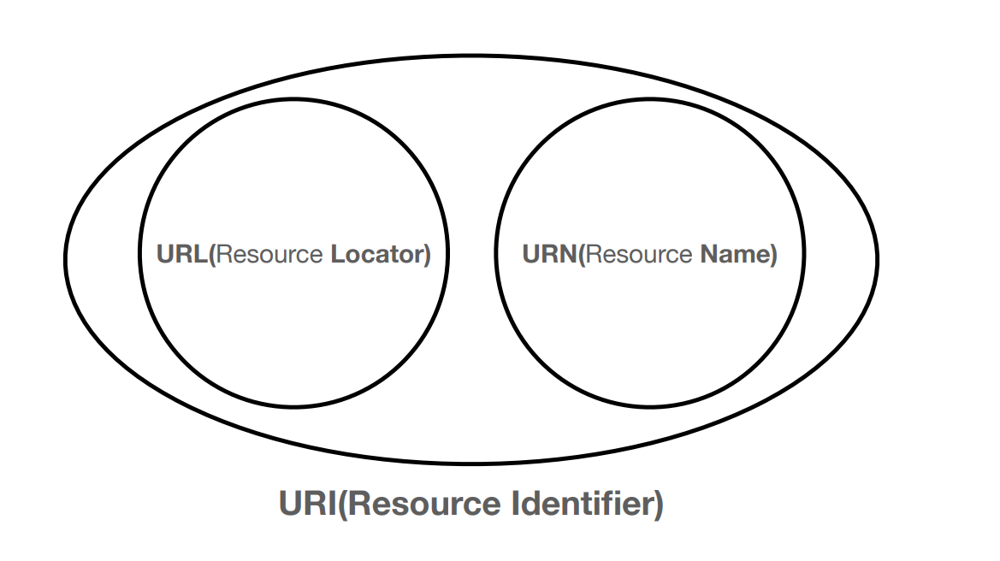

# URI & MIME type

## [URI](https://developer.mozilla.org/ko/docs/Web/HTTP/Basics\_of\_HTTP/Identifying\_resources\_on\_the\_Web) (Uniform Resource Identifier)

**리소스**를 식별하는 방법.

식별할 때는 식별자(Identifier = ID)를 활용.

<figure><figcaption>
URI
</figcaption></figure>

URI은 크게 둘로 나뉨:

1. URL(Uniform Resource Locator) → 리소스의 위치. 위치 변경에 취약함.
2. URN(Uniform Resource Name) → 리소스의 “유니크”한 이름. 사실상 쓰이지 않음.

URN 쓰는 걸 거의 본 적이 없음. \
따라서 URI와 URL을 크게 구별하지 않고 동의어에 가깝게 사용함.

## URI 구문

**스키마 또는 프로토콜**

<figure><figcaption></figcaption></figure>

`http://`는 프로토콜로, 브라우저가 사용해야 하는 프로토콜을 나타낸다

일반적으로 프로토콜은 HTTP이거나 보안 버전인 HTTPS입니다.&#x20;

웹은 이 두 가지 중 하나를 사용하지만, \
브라우저는 메일 클라이언트를 여는 `mailto:` 또는 파일 전송을 처리하는 `ftp:`와 같은 다른 프로토콜을 처리하는 방법도 알고 있으므로 이러한 프로토콜을 보더라도 놀라지 말자.&#x20;

일반적인 스키마는 다음과 같습니다.

| 스키마         | 설명                                                                                     |
| ----------- | -------------------------------------------------------------------------------------- |
| data        | [Data URL](https://developer.mozilla.org/ko/docs/Web/HTTP/Basics\_of\_HTTP/Data\_URLs) |
| file        | 호스트별 파일 이름                                                                             |
| ftp         | [File Transfer Protocol](https://developer.mozilla.org/ko/docs/Glossary/FTP)           |
| http/https  | [하이퍼 텍스트 전송 프로토콜 (보안)](https://developer.mozilla.org/ko/docs/Glossary/HTTP)            |
| javascript  | URL내 JavaScript 코드                                                                     |
| mailto      | 전자 메일 주소                                                                               |
| ssh         | 보안 쉘                                                                                   |
| tel         | 전화                                                                                     |
| urn         | 통합 자원 이름                                                                               |
| view-source | 리소스의 소스코드                                                                              |
| ws/wss      | [웹 소켓 연결 (보안)](https://developer.mozilla.org/ko/docs/Web/API/WebSockets\_API)          |

**도메인 이름**

<figure><figcaption></figcaption></figure>

`www.example.com`은 네임스페이스를 관리하는 도메인 이름 또는 기관이며 요청 중인 웹 서버를 나타냄 대신 [IP 주소](https://developer.mozilla.org/ko/docs/Glossary/IP\_Address)를 직접 사용하는 것도 가능하지만, 편의성이 떨어지므로 웹에서는 자주 사용되지 않는다.

**포트**

<figure><figcaption></figcaption></figure>

포트는 웹 서버의 리소스에 액세스하는 데 사용되는 기술적인 "게이트"를 나타낸다

웹 서버가 HTTP 프로토콜의 표준 포트(HTTP의 경우 80, HTTPS의 경우 443)를 사용하여 리소스에 접근하는 경우엔 일반적으로 포트가 생략

표준 포트를 사용하지 않는다면 필수로 입력해줘야 한다

**경로**

<figure><figcaption></figcaption></figure>

`/path/to/myfile.html`은 웹 서버의 리소스 경로

초기 웹에서는 이와 같은 경로가 웹 서버의 물리적 파일 위치를 나타냈다

하지만 요즘에는 물리적 파일을 나타내는것이 아닌 웹 서버에서 처리를 요청하는것에 가깝다

**쿼리**

<figure><figcaption></figcaption></figure>

`?key1=value1&key2=value2`는 웹 서버에 제공되는 추가 매개변수

이러한 매개변수는 `&` 기호로 구분된 키/값 쌍의 목록&#x20;

웹 서버는 이러한 매개변수를 사용하여 리소스를 사용자에게 반환하기 전에 추가적인 작업을 수행할 수 있습니다.&#x20;

**프래그먼트**

<figure><figcaption></figcaption></figure>

`#SomewhereInTheDocument`는 리소스 자체의 다른 부분에 대한 앵커&#x20;

앵커는 리소스 내부의 일종의 "북마크"를 나타내며 브라우저에 해당 "북마크된" 지점에 있는 콘텐츠를 표시하도록 지시한다

예를 들어 HTML 문서에서 브라우저는 앵커가 정의된 지점으로 스크롤하거나,\
비디오 또는 오디오 문서에서 브라우저는 앵커가 나타내는 시간으로 이동하려고 시도한다.

프래그먼트 식별자라고도 하는 # 뒤의 부분은 요청과 함께 서버로 전송되지 않습니다.

특정 content의 위치를 가르키기 위한 값이며,\
주로 긴 글에서 특정 문단을 가르키는 용도로 사용한다.

목차에 있는 소제목을 누르면 해당 문단으로 스크롤되는 경험이 프래그먼트 때문이다.

## [MIME Type](https://developer.mozilla.org/ko/docs/Web/HTTP/Basics\_of\_HTTP/MIME\_types)

Content의 종류를 표현.

Content Type, Media Type과 같은 뜻이다.

`<type>/<subtype>`의 형태로 쓴다.

MIME 타입은 대소문자를 구분하지는 않지만 전통적으로 소문자로 쓰여진다.

HTTP Headers에 `Content-Type` 속성으로 전달함. [IANA](https://www.iana.org/assignments/media-types/media-types.xhtml)에 등록된 목록을 참고하자.

1. `text/plain` ⇒ E-mail에서 자주 사용.
2. `text/html` ⇒ 일반적인 웹 문서. HTML 문서.
3. `text/css`
4. `text/javascript`
5. `application/xml` ⇒ 범용. **자기서술적(Self-descriptive)**이기 상대적으로 어렵다.
6. `application/atom+xml`
7. `application/json` ⇒ 범용. 자기서술적이기 굉장히 어렵다.
8. `application/dns+json`

