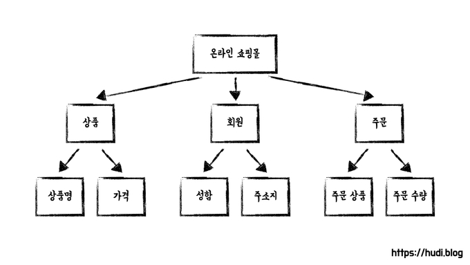
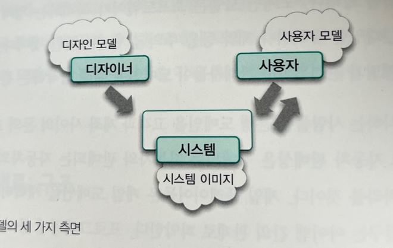

# Domain Model

## Domain Model이란

### Domain

Domain Model을 알기 전에 Domain에 대해서 먼저 알아보자

> 컴퓨터 프로그래밍으로 문제를 해결하기 위해 만들 소프트웨어 프로그램을 위한 요구사항, 용어, 기능을 정의하는 학문 영역이 도메인 공학이다.   -위키피디아-

사람들은 자신이 관심을 가지고 있는 특정 분야의 문제를 해결하기 위해 소프트웨어를 사용한다.\
사용자가 프로그램을 사용하는 **대상 분야**를 **도메인**이라고 한다.

은행에서 정기예금 기능을 제공하는 소프트웨어(시스템)를 만들고자 한다. \
이때 정기예금을 도메인이라고 한다. → 정기예금의 도메인 모델을 만들어야 한다.

도메인은 다시 하위 도메인으로 나뉘어질 수 있다.

<figure><figcaption><p>도메인과 하위 도메인</p></figcaption></figure>

예를 들어 우리가 '온라인 쇼핑몰' 을 개발한다면 이를 도메인이라고 부를 수 있다. 그리고 '온라인 쇼핑몰' 도메인은 또 다시 '상품', '회원', '주문' 이라는 하위 도메인으로 나누어질 수 있다.


### Domain Model

> **도메인 모델**이란 사용자가 프로그램을 사용하는 대상 영역에 관한 지식을 선택적으로 **단순화**하고 의식적으로 **구조화**한 형태다.    -객체지향의 사실과 오해-

도메인 모델은 이해관계자들이 바라보는 **멘탈 모델**이다.

* 멘탈 모델이란 사람들이 자기 자신, 다른 사람, 환경, 자신과 상호작용하는 사물들에 대해 갖는 모형이다.
* 사람들은 현실에 존재하지 않는 현상을 이해하고 반응하기 위해 마음 속에 멘탈 모델을 구축한다.

도메인 모델은 도메인에 대한 사용자 모델, 디자인 모델, 시스템 이미지를 **포괄**하도록 **추상화**한 소프트웨어 모델이다.

<figure><figcaption><p>멘탈모델의 세 가지 측면</p></figcaption></figure>

* 멘탈 모델은 세 가지로 구분할 수 있다.
* **사용자 모델**은 사용자가 제품에 대해 가지고 있는 개념들의 모습이다.
* **디자인 모델**은 설계자가 마음 속에 갖고있는 시스템에 대한 개념화다
* **시스템 이미지**는 최종 제품이다.

설계자는 디자인 모델을 기반으로 만든 시스템 이미지가 사용자 모델을 정확하게 반영하도록 노력해야한다. 즉 **도메인 모델**은 이 세 가지 모두를 포괄해야한다.

### Domain 객체

추상화한 도메인 모델을 코드로 표현하면 **도메인 객체 모델**(Domain Object Model)이 된다.

이를테면 위 도메인 모델의 <mark style="background-color:blue;">**상품 도메인**</mark>을  <mark style="background-color:blue;">**Item 클래스**</mark>로, <mark style="background-color:red;">**회원 도메인**</mark>을 <mark style="background-color:red;">**User 클래스**</mark>로 표현할 수 있을 것 이다.&#x20;

그리고 이것이 인스턴스화 된 것을 우리는 **'도메인 객체'** 라고 부를 수 있을 것 이다.

> An object model of the domain that incorporates both behavior and data.\
> \-마틴 파울러-

마틴 파울러에 따르면 도메인 객체는 **데이터**와 <mark style="color:red;">**행위**</mark>를 함께 가지고 있는 것 이라고 한다.&#x20;

좀 더 설명을 덧붙이자면, <mark style="color:red;">**특정한 책임**</mark>을 갖고 어플리케이션에서 **비즈니스 로직**을 수행하는 객체를 도메인 객체라고 할 수 있다.

* 행위 없이 코딩 (내가 너를 다 파악해서 조작하겠다 = 협력이 아님 = 복잡성이 감소하지 않음)
* 도메인 객체에게 요청하는 것이 아님 (=단일 책임 원칙을 깨뜨림)
* setter를 통해 상태를 바꾼다는 건, 캡슐화를 깨뜨리는 것임.
* 이것이 바로 Anemic Domain Model이며, 안티패턴으로 마틴파울러가 정의했다.
* 앞에서 DTO를 이용해 설계한 것이 바로 Anemic Domain Model이라 할 수 있다.

```java
Long amount = account.getAmount();
account.setAmount(amount + 10_000);
```

* 행위가 있다면? (내가 알게 뭐야 = 알아서 해 = 책임위임)
* 도메인 객체에게 요청하는 것&#x20;

```java
account.increateAmount(10_000);
```

## 4-Layered Architecture

다시 한 번 4-Layered Architecture에 대해 알아보자.


