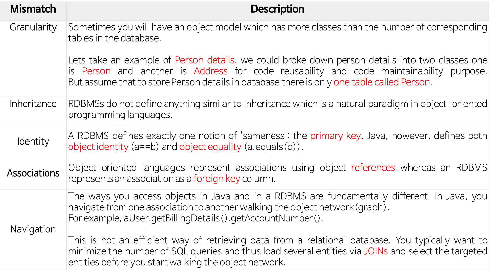

# ORM

## ORM

ORM이란 Object Relational Mapping (객체-관계 매핑)

참고로 Relational = Relation = Table이라고 이해하면 된다.

* 객체와 관계형 데이터베이스의 데이터를 자동으로 매핑(연결)해주는 것을 말한다.&#x20;
  * 객체 지향 프로그래밍은 클래스를 사용하고, 관계형 데이터베이스는 테이블을 사용한다.&#x20;
  * 객체 모델과 관계형 모델 간에 <mark style="background-color:orange;">**불일치**</mark>가 존재한다.&#x20;
  * ORM을 통해 <mark style="background-color:orange;">**객체 간의 관계**</mark>를 바탕으로 <mark style="background-color:orange;">**SQL을 자동으로 생성**</mark>하여 불일치를 해결한다.&#x20;
* 데이터베이스 데이터 <—매핑—> Object 필드 객체
  * ORM을 통해 간접적으로 데이터베이스 데이터를 다룰 수 있다.
* SQL 작성 및 매핑 작업이 자동으로 이뤄지기 때문에 우리가 비즈니스 로직에 집중할 수 있게 돕고 유지보수하기 좋다.
* 데이터베이스에 끌려가는 무기력한 도메인 객체가 아닌, 객체지향 원칙을 따르는 도메인 객체를 영속화할 수 있게 된다.

### 객체-관계 불일치 (Object–relational impedance mismatch)

출처 : [객체-관계 불일치](https://eun-jeong.tistory.com/31)

<figure><figcaption><p>O-R impedance mismatch</p></figcaption></figure>

**세분성(Granularity)**

경우에 따라서 데이터베이스에 있는 테이블 수보다 더 많은 클래스를 가진 모델이 생길 수 있다.

예를 들어, 어떤 사용자의 세부 사항에 대해 데이터를 저장한다고 해보자. 객체지향 프로그래밍에서는 코드 재사용과 유지보수를 위해 `Person`과 `Address`라는 두 개의 클래스로 나눠서 관리할 수 있다. 그러나, 데이터베이스에는 `person`이라는 하나의 테이블에 사용자의 세부사항을 모두 저장할 수 있다. 이 상황에서 Object는 2개, Table는 1개가 되어 개수가 달라지는 것이다.

**상속성(Inheritance)**

RDBMS는 객체지향 프로그래밍 언어의 특징인 상속 개념이 없다.

**일치(Identity)**

RDBMS는 'sameness'라는 하나의 개념을 정확히 정의하는데, 바로 기본키(Primary Key)를 이용하여 동일성을 정의한다. 그러나 자바는 객체 식별(`a == b`)과 객체 동일성(`a.equals(b)`)을 모두 정의한다.

즉, RDBMS에서는 PK가 같으면 서로 동일한 record로 정의하지만, Java에서는 주소값이 같거나(동일성) 내용이 같은 경우(동등성)를 구분해서 정의한다.

**연관성(Associations)**

객체지향 언어는 객체 참조(Reference)를 사용하는 연관성을 나타내는 반면, RDBMS는 연관성을 ‘외래키(Foreign Key)’로 나타낸다.

예를 들어, 자바에서의 객체 참조는 아래처럼 방향성이 있기 때문에,

```java
  public class Employee { 
      private int id; 
      private String first_name; 
      …
      private Department department; // Employee -> Department
      …
  }
```

양방향 관계가 필요한 경우 연관을 두 번 정의해야 한다. 즉, 서로 Reference를 가지고 있어야 한다. 그러나, RDBMS에서는 FK와 Join으로 자연스럽게 방향성이 없는 연결이 이루어진다.


**탐색(Navigation)**

자바와 RDBMS에서 객체를 접근하는 방법이 근본적으로 다르다.

자바는 **그래프 형태**로 하나의 연결에서 다른 연결로 이동하며 탐색한다. 예를 들어, `user.getBillingDetails().getAccountNumber()`의 형식이다. 그러나 RDBMS에서는 일반적으로 쿼리 수를 최소화하고 `JOIN`을 통해 여러 엔티티를 로드하고 원하는 대상 엔티티를 선택(select)하는 방식으로 탐색한다.


## JPA (Jakarta Persistence API)

* **Jakarta EE**의 관계형 데이터 관리 API.&#x20;
* Java에서 사용하는 ORM 표준이라고 볼 수 있다.
* JPA는 인터페이스, 즉 스펙만 다루고 있기 때문에 Hibernate, EclipseLink 등의 구현을 사용하게 된다.
* &#x20;공식적으로는 EclipseLink가 참조 구현이지만, 업계에서 오래 전부터 써왔고 JPA 스펙에 막대한 영향을 끼친 **Hibernate**가 가장 널리 사용된다.

### Jakarta EE

* Jakarta EE는 자바를 이용한 서버측 개발을 위한 플랫폼이다.&#x20;
* Jakarta EE 플랫폼은 PC에서 동작하는 표준 플랫폼인 Java SE에 부가하여, 웹 애플리케이션 서버에서 동작하는 장애복구 및 분산 멀티티어를 제공하는 자바 소프트웨어의 기능을 추가한 서버를 위한 플랫폼이다.&#x20;
* 이전에는 J2EE라 불리었으나 버전 5.0 이후로 Java EE로 개칭되었으며 2017년 프로젝트가 이클립스 재단으로 이관됨에 따라 Jakarta EE로 변경되었다.

### JPA Entity

Entity-Relationship-Model (ERM)을 정리할 때도 잠깐 언급했었다.

* JPA에서 Entity는,  OOP의 Entity랑 다르다
  * 데이터 모델에서의 Entity는 행위가 없다. 그냥 데이터일 뿐이다.
* DB 세계와 관련: “Entities represent persistent data **stored in a relational database** automatically using container-managed persistence.”
* OOP 세계와 관련: “An entity models a **business entity** or **multiple actions** within a single business process.”
* JPA는 **Relationship Mapping**과 **Aggregate Mapping** 등을 지원하고, \
  이를 잘 활용함으로써 객체(Object)와 관계(Relational)를 적절히 조화시킬 수 있다.
